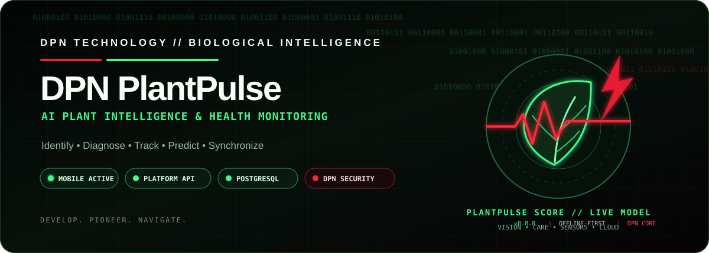
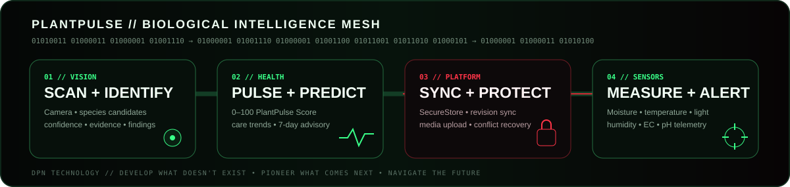
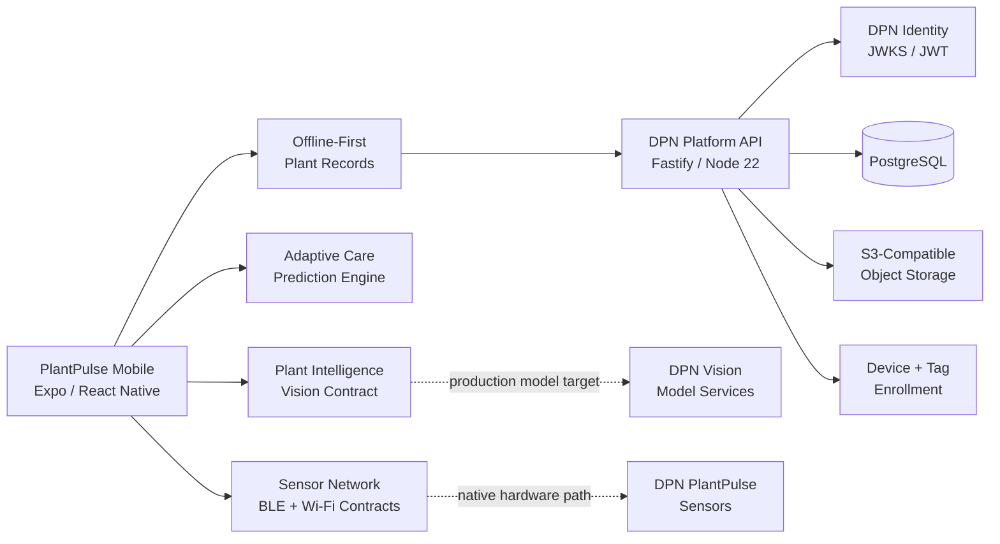

<!-- DPN-REPO-HERO:START -->
<p align="center">
  
</p>

<p align="center">
  
  
  
  
  
</p>
<!-- DPN-REPO-HERO:END -->

<!-- DPN-LIVE-STATUS:START -->
<p align="center">
  
  
  
  
  
  
</p>
<!-- DPN-LIVE-STATUS:END -->

<!-- DPN-REPO-SHOWCASE:START -->
<p align="center">
  
</p>

<p align="center">
  <a href="#-current-engineering-state"><strong>System Status</strong></a>
  &nbsp;•&nbsp;
  <a href="#-architecture"><strong>Architecture</strong></a>
  &nbsp;•&nbsp;
  <a href="#-run-plantpulse"><strong>Run PlantPulse</strong></a>
  &nbsp;•&nbsp;
  <a href="#-security--trust-boundary"><strong>Security</strong></a>
  &nbsp;•&nbsp;
  <a href="docs/ROADMAP.md"><strong>Roadmap</strong></a>
</p>
<!-- DPN-REPO-SHOWCASE:END -->

# 🌿 DPN PlantPulse

> **AI Plant Intelligence & Health Monitoring**  
> **DEVELOP. PIONEER. NAVIGATE.**

**DPN PlantPulse** is DPN Technology's mobile-first biological intelligence platform. It is designed around one core idea:

> A plant should not be treated as a one-time identification result. It should become a living digital asset with an evolving health record, care history, scan history, sensor context, predictive signals, and synchronized DPN platform identity.

PlantPulse combines a React Native mobile experience, plant-health intelligence workflows, offline-first records, optional sensor telemetry, secure cloud synchronization, and a DPN Platform backend.

It is **not** intended to be a branded clone of an existing plant identifier.

---

## 🧬 Current Engineering State

| Layer | Current state | Evidence in this repository |
| --- | --- | --- |
| **Mobile application** | ✅ Implemented | Expo / React Native client, scanner, plant records, care, sensors, platform UI |
| **PlantPulse Score** | ✅ Implemented prototype | 0–100 score + telemetry breakdown + longitudinal history |
| **Vision workflow** | ✅ Client contract / prototype provider | camera, image import, confidence, findings, evidence, growth comparison |
| **Adaptive care** | ✅ Implemented advisory engine | trend model, 7-day projection, recommendation feedback and apply flow |
| **Sensor network** | ✅ Protocol + telemetry model | moisture, temperature, humidity, light, EC, pH, device state and alerts |
| **Offline-first records** | ✅ Implemented | local/remote revisions, dirty state, conflict detection, retry metadata |
| **DPN Platform service** | ✅ Implemented | Fastify / Node 22, PostgreSQL, JWT/JWKS, media grants, devices, tags |
| **Signed media sync** | ✅ Implemented | signed PUT upload path, cloud object keys, media deduplication |
| **Conflict recovery** | ✅ Implemented | explicit **KEEP LOCAL** / **USE REMOTE** resolution |
| **Native secret storage** | ✅ Implemented | Expo SecureStore on Android/iOS |
| **DPN OIDC client** | ✅ Implemented | discovery, Authorization Code + PKCE, UserInfo, refresh and revocation lifecycle |
| **Native background sync** | ✅ Implemented | Expo BackgroundTask / TaskManager worker using the existing conflict-safe sync engine |
| **Push delivery** | ✅ Implemented service path | PostgreSQL outbox, Expo Push tickets/receipts, retry/backoff, invalid-token retirement |
| **Notification policy** | ✅ Implemented | server-enforced category controls, quiet hours and IANA timezone |
| **Device trust** | ✅ Implemented | ownership-safe enrollment, inventory and sticky revocation |
| **Operational health** | ✅ Implemented durable view | plant/device/outbox counters exposed through authenticated control-plane API |
| **Production botanical AI** | ⛔ Not claimed | production model training/calibration remains future work |
| **Production DPN cloud deployment** | ⛔ Not claimed | production identity, managed DB/storage, DNS/TLS/gateway remain provisioning work |

> **Repository presentation rule:** PlantPulse visuals describe the product and repository architecture. They must never be presented as proof that an undeployed backend, model, sensor, or production service is already live.

---

## 🌱 PlantPulse Intelligence Stack

<table>
<tr>
<td width="25%" valign="top">

### 👁 Vision
- Live camera scanner
- Photo-library import
- Identify / Health / Disease
- Leaf / Pest / Soil / Growth
- Confidence bands
- Ranked candidates
- Evidence surfaces

</td>
<td width="25%" valign="top">

### 💚 Health
- PlantPulse Score
- Health telemetry
- Scan history
- Timeline events
- Growth comparison
- 7-day prediction
- Risk watchlist

</td>
<td width="25%" valign="top">

### ⚡ Care
- Water / feed schedules
- Care completion events
- Adaptive recommendations
- User feedback loop
- Species-aware baselines
- Location / room records
- Predictive care context

</td>
<td width="25%" valign="top">

### 🌐 Platform
- Secure identity session
- Offline-first revisions
- PostgreSQL backend
- Signed image upload
- Conflict recovery
- Device enrollment
- PlantPulse QR tags

</td>
</tr>
</table>

---

## 📡 Biological Network Telemetry

PlantPulse treats every saved plant like a monitored node in a biological network.

| Signal | PlantPulse behavior |
| --- | --- |
| **Health** | current PlantPulse Score and score band |
| **Hydration** | scan evidence + care history + optional measured sensor context |
| **Light** | image-derived compatibility today; measured sensor data where connected |
| **Nutrition** | advisory signal and feeding history |
| **Disease / pest risk** | confidence-scored candidate findings, not absolute diagnosis |
| **Growth** | longitudinal scan comparison |
| **Environment** | optional measured temperature, humidity, moisture, light, EC and pH |
| **Sync state** | LOCAL_ONLY / DIRTY / SYNCED / CONFLICT / ERROR |
| **Predictive state** | LOW / WATCH / ELEVATED / HIGH |

### PlantPulse Score

| Score | State |
| ---: | --- |
| **90–100** | 🟢 Excellent |
| **75–89** | 🟢 Healthy |
| **60–74** | 🟡 Fair |
| **40–59** | 🟠 Poor |
| **0–39** | 🔴 Critical |

The current score is a product-development model. A future production score is intended to combine calibrated scan evidence, care history, environmental context, trend data, and measured sensor telemetry.

---

## 🏗 Architecture



### Synchronization path

```text
LOCAL PLANT CHANGE
      │
      ├── mark local revision DIRTY
      │
      ├── upload pending local image
      │      └── signed object-storage PUT
      │
      ├── pull current remote revisions
      │
      ├── compare local / remote
      │      ├── clean → continue
      │      └── divergent → CONFLICT
      │
      ├── push cloud-safe plant record
      │
      ├── claim PlantPulse tag
      │
      └── enroll / refresh client device
```

PlantPulse does **not** silently use last-write-wins when both sides changed. Conflicts are blocked until the user explicitly chooses **KEEP LOCAL** or **USE REMOTE**.

---

## 🛡 Security & Trust Boundary

DPN PlantPulse is designed so product polish does not hide engineering boundaries.

### Implemented security controls

- native bearer-token persistence through **Expo SecureStore** on Android/iOS;
- bearer tokens deliberately stripped from AsyncStorage platform state;
- JWKS-backed JWT signature verification on the platform service;
- issuer, audience and tenant-claim validation;
- tenant-scoped PostgreSQL queries;
- server-side optimistic concurrency;
- authenticated API rate limiting with HTTP **429**;
- signed, short-lived media upload grants;
- upload content-type and size validation;
- security headers;
- audit-event persistence;
- CodeQL scanning;
- dependency audit gates;
- real PostgreSQL integration tests.

### Not yet represented as production-complete

- production DPN One authorization-server deployment / client registration;
- renewable token refresh + revocation UX;
- production PostgreSQL deployment;
- production object-storage bucket/KMS policy;
- production DNS/TLS/API gateway;
- production push credentials / provider environment validation;
- production proof of background execution across supported physical devices;
- production botanical computer-vision models;
- native PlantPulse BLE hardware implementation;
- calibrated agronomic prediction models.

> Plant identification and health inference are probabilistic. PlantPulse must expose uncertainty and must not convert low-confidence inference into absolute toxicity, pesticide, ingestion, diagnosis, or treatment claims.

See [SECURITY.md](SECURITY.md) and [docs/ARCHITECTURE.md](docs/ARCHITECTURE.md).

---

## 🛰 DPN Platform Surface

The current platform layer includes:

```text
GET  /health
GET  /ready
GET  /v1/me
GET  /v1/plants
PUT  /v1/plants/:plantId
POST /v1/media/uploads
GET  /v1/devices
POST /v1/devices
DELETE /v1/devices/:deviceId
GET  /v1/notification-preferences
PUT  /v1/notification-preferences
GET  /v1/operations/health
POST /v1/plant-tags/claim
POST /v1/notifications/queue
```

The backend currently provides:

- Fastify / Node.js 22 runtime;
- PostgreSQL persistence;
- row-locked optimistic revision checks;
- ownership-safe device registration and sticky revocation;
- notification policy / quiet-hour enforcement;
- authenticated operational health counters;
- unique PlantPulse tag claiming;
- audit events;
- S3-compatible signed uploads;
- PostgreSQL notification outbox with per-device deduplication;
- Expo Push Service ticket/receipt delivery worker;
- local Docker / PostgreSQL / MinIO development environment;
- integration coverage against real disposable PostgreSQL in CI.

See [docs/PLATFORM_API.md](docs/PLATFORM_API.md) and [server/README.md](server/README.md).

---

## 📲 Run PlantPulse

### Requirements

- Node.js **22.13+**
- npm
- Expo-compatible Android/iOS development environment
- Expo Go for basic camera/UI testing
- development build for native features that Expo Go does not support

### Mobile client

```bash
npm install
npm start
```

Useful commands:

```bash
npm run android
npm run ios
npm run web

npm run typecheck
npm run doctor
npm run test:mobile-platform

npm run server:typecheck
npm run server:build
npm run server:test
```

### Local DPN Platform stack

```bash
docker compose -f docker-compose.platform.yml up --build
```

The local stack includes:

- PlantPulse platform service;
- PostgreSQL;
- MinIO-compatible object storage.

Development builds can connect to that local service from the **DPN Platform** screen.

### Mobile runtime environment

Copy **.env.example** and configure public build-time values only:

```text
EXPO_PUBLIC_DPN_PLATFORM_BASE_URL=
EXPO_PUBLIC_DPN_IDENTITY_ISSUER=
EXPO_PUBLIC_DPN_IDENTITY_CLIENT_ID=
EXPO_PUBLIC_DPN_IDENTITY_SCOPES=openid profile email offline_access
EXPO_PUBLIC_DPN_IDENTITY_TENANT_CLAIM=tenant_id
EXPO_PUBLIC_EAS_PROJECT_ID=
```

> Never place client secrets, access tokens, refresh tokens, private keys, database passwords, object-store credentials, or other secrets in EXPO_PUBLIC variables. The OIDC client ID is public; a mobile client secret is intentionally not used.

---

## 🗂 Repository Map

```text
App.tsx                         Main PlantPulse mobile application surface
src/
  care*.ts                      Care scheduling, intelligence and recommendation logic
  sensors.ts                    Sensor telemetry / alert model
  platformRuntime.ts            Mobile sync / retry / device / conflict orchestration
  backgroundSync.ts              Native deferrable background sync worker
  platformSync.ts               Revision reconciliation and conflict handling
  mediaSync.ts                  Signed media upload execution
  secureIdentity.ts             Native SecureStore identity boundary
  services/
    plantIntelligence.ts        Vision provider abstraction
    platformApi.ts              DPN Platform mobile API client

server/
  src/app.ts                    Fastify API surface
  src/auth.ts                   JWKS + development auth modes
  src/postgresRepository.ts     PostgreSQL persistence and concurrency
  src/objectStore.ts            Signed S3-compatible media grants
  src/notificationRepository.ts  PostgreSQL push outbox leasing / dedupe
  src/pushProvider.ts            Expo Push Service transport
  src/pushWorker.ts              Ticket / receipt / retry delivery worker
  db/schema.sql                 Platform database schema
  test/                         API + PostgreSQL integration coverage

docs/
  ARCHITECTURE.md
  DATA_MODEL.md
  VISION_API.md
  ADAPTIVE_CARE.md
  SENSOR_PROTOCOL.md
  PLATFORM_API.md
  ROADMAP.md

.github/
  readme-hero.svg               PlantPulse repository hero
  repo-showcase.svg             Capability mesh
  workflows/                    CI + CodeQL
```

---

## 🧪 Quality Gates

Every major PlantPulse change is expected to clear:

```text
Mobile TypeScript
Platform TypeScript
Platform build
Mobile platform connectivity tests
Expo Doctor
Critical dependency audit
PostgreSQL schema migration
PostgreSQL integration tests
JavaScript / TypeScript CodeQL
GitHub Advanced Security
```

No red gate is treated as cosmetic.

---

## 🖼 Repository Visual Evidence

<table>
<tr>
<td align="center" width="50%">
  <br>
  <sub>DPN PlantPulse repository identity</sub>
</td>
<td align="center" width="50%">
  <br>
  <sub>PlantPulse capability / architecture presentation</sub>
</td>
</tr>
</table>

> These are **repository-native presentation assets**, not screenshots of runtime execution. Runtime screenshots should only be added when captured from an actual build and labeled with their source/version.

---

## 🧭 Roadmap

The next production-readiness priorities are:

1. **DPN One identity deployment** — provision the authorization server/client registration that the v0.9 OIDC client is ready to use.
2. **Identity operations** — key rotation, client registration policy, revocation evidence and device trust.
3. **Background-sync validation** — prove deferrable execution on signed physical-device builds across iOS/Android power states.
4. **Push productionization** — provision production push credentials and external delivery/SLO dashboards; v0.11 now includes server-side notification preferences and durable operational counters.
5. **Media verification** — server-side completion and object validation.
6. **Production deployment** — managed PostgreSQL, object storage, DNS/TLS/API gateway and observability.
7. **Production Plant Intelligence** — trained/calibrated botanical models and verified safety knowledge.

Full engineering roadmap: [docs/ROADMAP.md](docs/ROADMAP.md)  
Production-readiness gate: [docs/PRODUCTION_READINESS.md](docs/PRODUCTION_READINESS.md)  
DPN Identity / OIDC client: [docs/OIDC_IDENTITY.md](docs/OIDC_IDENTITY.md)

---

## 🌿 Product Family Direction

| Product | Target |
| --- | --- |
| **PlantPulse Home** | houseplants, home gardens and personal collections |
| **PlantPulse Pro** | landscapers, nurseries and professional service teams |
| **PlantPulse Grow** | greenhouses and controlled growing environments |
| **PlantPulse Enterprise** | large multi-site sensor-connected plant operations |

---

<!-- DPN-ECOSYSTEM:START -->
## ⚡ DPN Ecosystem

**Category:** Biological Intelligence / AI / Connected Systems

[**DPN One**](https://github.com/DPN-Technology/DPN-One) ·
[**DPN AI**](https://github.com/DPN-Technology/DPN-AI) ·
[**DPN Operational Control**](https://github.com/DPN-Technology/DPN-Operational-Control) ·
[**DPN Network Mapper**](https://github.com/DPN-Technology/DPN-Network-Mapper) ·
[**DPN Website**](https://github.com/DPN-Technology/DPN-Website)

<details>
<summary><strong>Explore the broader DPN Technology platform</strong></summary>

| Control & Infrastructure | Business Operations | Development & AI | Simulation & Interactive |
| --- | --- | --- | --- |
| [DPN Operational Control](https://github.com/DPN-Technology/DPN-Operational-Control) | [DPN One](https://github.com/DPN-Technology/DPN-One) | [DPN AI](https://github.com/DPN-Technology/DPN-AI) | [DPN War Simulator](https://github.com/DPN-Technology/DPN-War-Simulator) |
| [DPN Executive Control System](https://github.com/DPN-Technology/DPN-Executive-Control-System) | [DPN Human Resources](https://github.com/DPN-Technology/DPN-Human-Resources-Software) | [Death the Developer](https://github.com/DPN-Technology/DPN-Death-the-Developer) | [Tool & Die Simulator](https://github.com/DPN-Technology/DPN-Tool-Die-Simulator) |
| [DPN WatchTower](https://github.com/DPN-Technology/DPN-Watch-Tower) | [DPN Workforce](https://github.com/DPN-Technology/DPN-Workforce-Time-Management-System) | [DPN Website](https://github.com/DPN-Technology/DPN-Website) | [MemeSpace](https://github.com/DPN-Technology/MemeSpace) |
| [DPN Network Mapper](https://github.com/DPN-Technology/DPN-Network-Mapper) | [DPN Service Desk](https://github.com/DPN-Technology/DPN-Service-Desk) | **DPN PlantPulse** | [DPN Aqua Labs](https://github.com/DPN-Technology/DPN-Aqua-Labs-Point-of-Sale-System) |

</details>
<!-- DPN-ECOSYSTEM:END -->

---

<p align="center">
  <strong>DPN TECHNOLOGY // DPN PLANTPULSE</strong><br>
  <sub>WE DEVELOP WHAT DOESN'T EXIST. WE PIONEER WHAT COMES NEXT. WE NAVIGATE THE FUTURE.</sub><br><br>
  <strong>🌱 DEVELOP BIOLOGICAL INTELLIGENCE.</strong>
</p>
